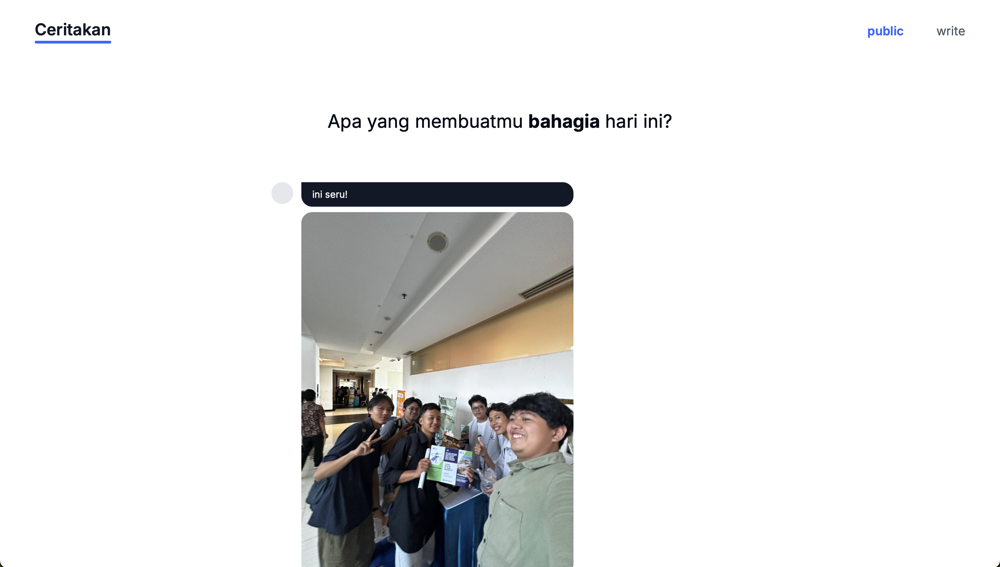

# Ceritakan

*Ceritakan* adalah aplikasi web sederhana dan intuitif di mana pengguna dapat berbagi pemikiran atau foto berdasarkan prompt harian. Dirancang dengan antarmuka minimalis dan fokus pada ekspresi pengguna, aplikasi ini membantu orang untuk merenung dan berbagi secara anonim dengan orang lain.

---




---

## Fitur ✨  

- **Prompt Harian:** Pertanyaan baru setiap hari, contohnya: *"Apa yang membuatmu bahagia hari ini?"*  
- **Berbagi Pemikiran atau Foto:** Pengguna dapat merespon prompt dengan teks atau mengunggah foto.  
- **Berbagi Secara Anonim:** Kiriman akan dibagikan secara anonim di bagian *Public*.  
- **Navigasi Sederhana:** Dua halaman utama:
  - **Write:** Untuk mengirimkan respons pengguna.  
  - **Public:** Untuk melihat respons anonim dari pengguna lain.  
- **UI Elegan:** Desain bersih dengan fokus pada kesederhanaan dan kenyamanan pengguna.  

---

## Palet Warna 🎨  

- **Warna Utama:** #3366FF  
- **Latar Belakang:** Putih  

---

## Instalasi & Pengaturan 🚀  

1. Clone repositori ini:  
   ```bash  
   git clone https://github.com/feboyfierlyan/ceritakan.git  
   cd ceritakan  
2. Install dependencies:
   ```bash
   npm install
3. Run server:
   ```bash
   npm run dev
4. Buka di browser:
   http://localhost:3000

## Lisensi
Proyek ini dilisensikan di bawah Lisensi MIT. Lihat file LICENSE untuk informasi lebih lanjut.

## Kontak
Untuk pertanyaan, masukan, atau saran, jangan ragu untuk menghubungi:

Email: feboyfierlyan10@gmail.com
